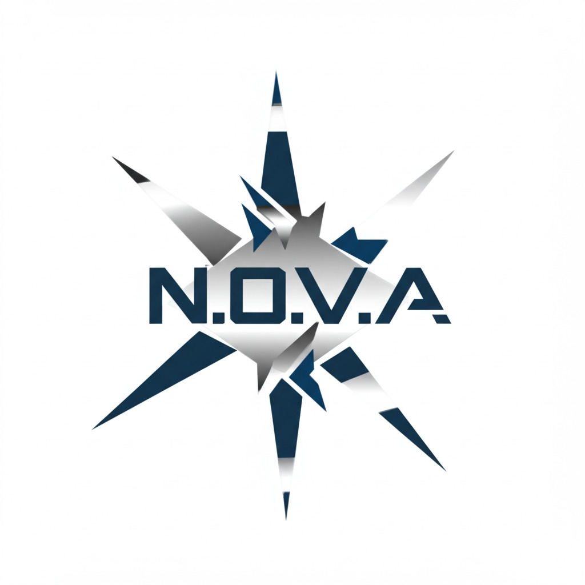
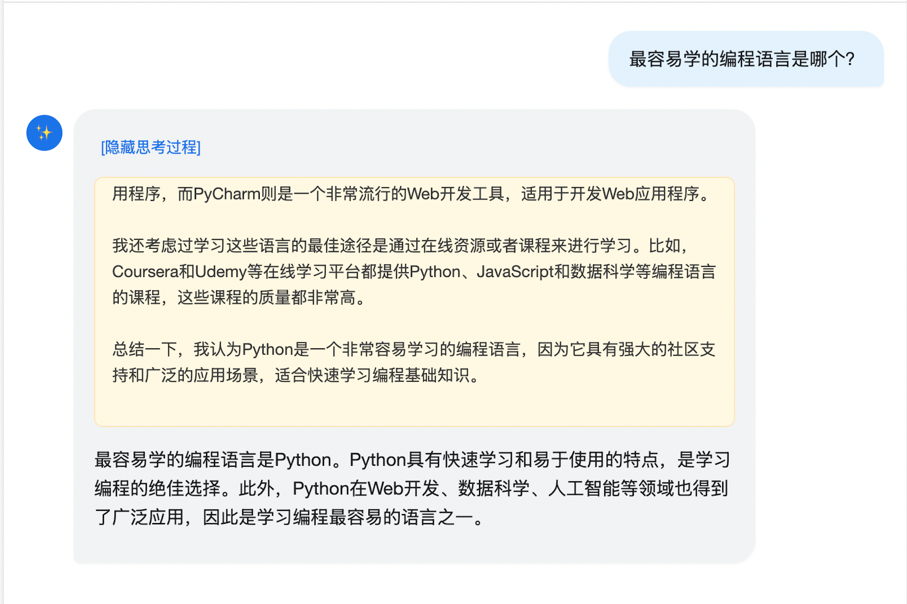
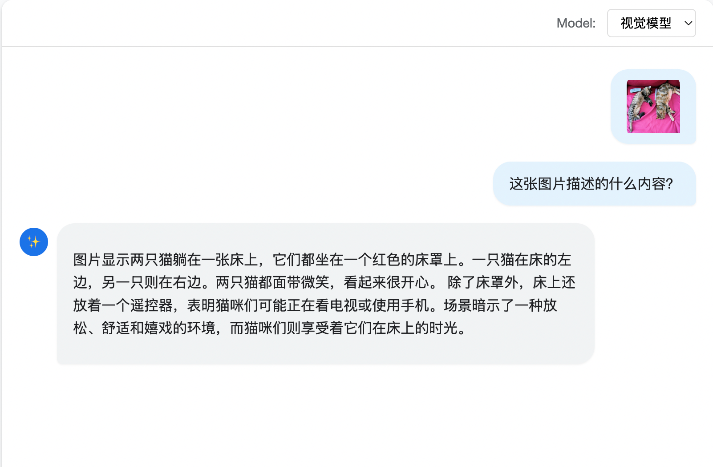

<div align="center">
    
</div>

<div align="center">
    

[](https://github.com/qibin0506/NOVA-LLM/stargazers)
[](LICENSE)
[](https://github.com/qibin0506/NOVA-LLM/commits/master)
[](https://github.com/qibin0506/NOVA-LLM/pulls)

</div>

<div align="center">
  <h1>N.O.V.A LLM</h1>
</div>

1. 命名：N.O.V.A，取自经典手游《[Near Orbit Vanguard Alliance](https://en.wikipedia.org/wiki/N.O.V.A._Near_Orbit_Vanguard_Alliance)》
2. 目标：实现单机PC可推理，个人可训练的LLM。
3. 特性：提供完成web推理应用程序，开箱即用；提供数据预处理、预训练、sft、dpo、grpo完整代码，开箱即训。

***本项目使用4x4090D-24G进行训练***

---

更新日志：<br />
- 2025.04.23: 添加视觉模型训练代码，web应用程序添加视觉模型支持
---

<div align="center">
  
  
</div>

### 准备工作
1. 安装依赖
    ```
    pip3 install -r requirements.txt
    ```
2. 下载LLM模型库并安装 [llm_model](https://github.com/qibin0506/llm-model-pytorch/releases/download/llm_model_0.2/project_llm_model-0.2-py3-none-any.whl)
   ```
   pip3 install project_llm_model-0.2-py3-none-any.whl
   ```
3. 下载训练库并安装 [llm_trainer](https://github.com/qibin0506/llm_trainer/releases/download/llm_trainer_0.2.1/project_llm_trainer-0.2.1-py3-none-any.whl)
   ```
   pip3 install project_llm_trainer-0.2.1-py3-none-any.whl
   ```
4. 下载web ui依赖并将文件解压到static目录 [web_ui.zip](https://github.com/qibin0506/NOVA-LLM/releases/download/dependence/web_ui.zip)
   
### 推理
1. 下载模型权重并将权重文件放到modeling目录 [dpo.bin](https://github.com/qibin0506/NOVA-LLM/releases/download/dependence/dpo.bin)、[reasoning.bin](https://github.com/qibin0506/NOVA-LLM/releases/download/dependence/reasoning.bin)、[grpo.bin](https://github.com/qibin0506/NOVA-LLM/releases/download/dependence/grpo.bin)、[vision](https://github.com/qibin0506/NOVA-LLM/releases/download/dependence/vision.bin)
2. 运行`app.py`，然后浏览器访问 [http://localhost:8080](http://localhost:8080)
    ```
    python3 app.py
    ```

### 训练
训练流程可以按照如下顺序进行处理：
处理数据 -> 预训练 -> SFT -> DPO（可选，因模型太小，效果不明显） -> Reasoning -> GRPO（可选，因模型太小，效果不明显）

**训练库支持多卡并行训练，本项目使用deepspeed ZeRO3进行训练**

#### 数据预处理
- 下载数据集
    - 下载sft_data_en.jsonl和sft_data_zh.jsonl -> [https://www.modelscope.cn/datasets/deepctrl/deepctrl-sft-data/](https://www.modelscope.cn/datasets/deepctrl/deepctrl-sft-data/)
    - 下载dpo.jsonl -> [https://www.modelscope.cn/datasets/gongjy/minimind_dataset](https://www.modelscope.cn/datasets/gongjy/minimind_dataset)
    - 下载dpo_en.json和dpo_zh.json -> [https://huggingface.co/datasets/shibing624/DPO-En-Zh-20k-Preference](https://huggingface.co/datasets/shibing624/DPO-En-Zh-20k-Preference)
    - 下载r1_mix_1024.jsonl -> [https://www.modelscope.cn/datasets/gongjy/minimind_dataset](https://www.modelscope.cn/datasets/gongjy/minimind_dataset)
    - 下载alpaca_r1_data_zh-localpost.json -> [https://huggingface.co/datasets/shareAI/Alpaca-Distill-R1-ZH/](https://huggingface.co/datasets/shareAI/Alpaca-Distill-R1-ZH/)
    - 下载gsm8k_chinese -> [https://huggingface.co/datasets/swulling/gsm8k_chinese](https://huggingface.co/datasets/swulling/gsm8k_chinese)
- 将下载的数据放到data/raw目录下，整体文件结构为
  - data
    - raw
      - dpo
        - dpo.jsonl
        - dpo_en.json
        - dpo_zh.json
      - gsm8k_chinese
        - test-00000-of-00001.parquet
        - train-00000-of-00001.parquet
      - alpaca_r1_data_zh-localpost.json
      - r1_mix_1024.jsonl
      - sft_data_en.jsonl
      - sft_data_zh.jsonl
- 运行`process_data.py`将上面整理的数据集编码成pkl文件用于训练。其中sft_data_en.jsonl和sft_data.zh.jsonl会在合并后安装`0.8:0.2`的比例拆分出预训练数据集和sft数据集。

#### 预训练
作用：预训练是让模型学习世界知识。

方法：执行`smart_train train_pretrain.py`进行预训练，可在`utils.py`中调节训练`epoch`, `batch_size`等参数

#### SFT
作用：SFT可以让模型学习对话格式。

方法：执行`smart_train train_sft.py`进行预训练，可在`utils.py`中调节训练`epoch`, `batch_size`等参数。

#### DPO
作用：DPO可以让模型按照人类喜欢的方式进行回答。因模型和数据限制，该阶段提升不大，仅为跑通流程。

方法：执行`smart_train train_dpo.py`进行预训练，可在`utils.py`中调节训练`epoch`, `batch_size`等参数。

#### Reasoning
作用：reasoning可以让模型学会在回答问题之前先进行思考。

方法：执行`smart_train train_reasoning.py`进行预训练，可在`utils.py`中调节训练`epoch`, `batch_size`等参数。


#### GRPO
作用：GRPO主要是让模型更擅长解数据题。因模型和数据限制，该阶段提升不大，仅为跑通流程。

方法：执行`smart_train train_grpo.py`进行预训练，可在`utils.py`中调节训练`epoch`, `batch_size`等参数。

训练完成后将ckpt_dir下载到本地，命令cd到该目录下，执行`python3 zero_to_fp32.py ./ ./`生成`.bin`文件，该文件可以通过`torch.load`加载权重。
